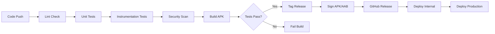

# DroidPipe 🚀

[](https://github.com/aolad-anna/droidpipe/actions/workflows/ci.yaml)
[](https://github.com/aolad-anna/droidpipe/actions/workflows/cd.yaml)
[](https://codecov.io/gh/aolad-anna/droidpipe)
[](https://sonarcloud.io/summary/new_code?id=aolad-anna_droidpipe)
[](https://www.gnu.org/licenses/gpl-3.0)

> **Production-ready CI/CD pipeline for Android applications with comprehensive testing, security scanning, and automated deployment to Google Play Store.**

## 📋 Table of Contents

- [Overview](#overview)
- [Features](#features)
- [Architecture](#architecture)
- [Tech Stack](#tech-stack)
- [Getting Started](#getting-started)
- [CI/CD Pipeline](#cicd-pipeline)
- [Testing](#testing)
- [Deployment](#deployment)
- [Configuration](#configuration)
- [Contributing](#contributing)
- [License](#license)

## 🎯 Overview

DroidPipe is a comprehensive DevSecOps pipeline implementation for Android applications, demonstrating industry best practices in mobile app development, testing, security, and deployment automation. This project showcases a complete CI/CD workflow from code commit to production release.

### Key Highlights

- ✅ **Automated Quality Checks**: Lint, code formatting, and static analysis
- ✅ **Comprehensive Testing**: Unit tests, instrumentation tests, and UI tests
- ✅ **Security Scanning**: Snyk vulnerability scanning and dependency review
- ✅ **Code Coverage**: JaCoCo reports integrated with Codecov
- ✅ **Automated Releases**: Signed APK/AAB generation and GitHub releases
- ✅ **Play Store Deployment**: Automated deployment to internal testing and production
- ✅ **Multi-API Testing**: Matrix testing across Android API levels

## ✨ Features

### CI Pipeline

1. **Code Quality**
   - Android Lint checks
   - Kotlin code style (ktlint)
   - SonarQube code analysis
   - Code duplication detection

2. **Testing**
   - Unit tests with JUnit
   - Instrumentation tests with Espresso
   - UI Automator tests
   - Code coverage reporting (JaCoCo)
   - Multi-API level testing (API 29, 30, 33)

3. **Security**
   - Snyk vulnerability scanning
   - Dependency review
   - SARIF report generation
   - ProGuard/R8 code obfuscation

4. **Build**
   - Debug APK generation
   - Build artifact archiving
   - Gradle caching for faster builds

### CD Pipeline

1. **Release Management**
   - Signed APK generation
   - App Bundle (AAB) generation
   - Automated versioning
   - GitHub releases creation

2. **Deployment**
   - Google Play Internal Testing
   - Staged production rollout
   - Service account authentication
   - Release notes generation

3. **Notifications**
   - Build status notifications
   - Deployment success/failure alerts
   - GitHub commit status updates

## 🏗️ Architecture

```
DroidPipe/
├── .github/
│   └── workflows/
│       ├── ci.yaml              # Continuous Integration
│       └── cd.yaml              # Continuous Deployment
├── app/
│   ├── src/
│   │   ├── main/                # Application source code
│   │   ├── test/                # Unit tests
│   │   └── androidTest/         # Instrumentation tests
│   ├── build.gradle             # App module config
│   └── proguard-rules.pro       # ProGuard rules
├── gradle/
├── build.gradle                 # Root build config
└── README.md
```

### CI/CD Pipeline Flow



## 🛠️ Tech Stack

### Development
- **Language**: Kotlin
- **Min SDK**: 24 (Android 7.0)
- **Target SDK**: 34 (Android 14)
- **Build System**: Gradle 8.0
- **Architecture**: MVVM + Clean Architecture

### Libraries & Frameworks
- **AndroidX**: Core, AppCompat, Lifecycle
- **Networking**: Retrofit, OkHttp
- **Dependency Injection**: Hilt/Dagger
- **Image Loading**: Glide
- **Coroutines**: Kotlin Coroutines
- **Navigation**: Navigation Component

### Testing
- **Unit Testing**: JUnit, Mockito, Truth
- **Instrumentation**: Espresso, UI Automator
- **Code Coverage**: JaCoCo
- **Mocking**: MockWebServer

### DevOps & CI/CD
- **CI/CD**: GitHub Actions
- **Code Quality**: SonarQube/SonarCloud
- **Security**: Snyk
- **Coverage**: Codecov
- **Code Style**: ktlint
- **Signing**: Android App Signing

## 🚀 Getting Started

### Prerequisites

- Android Studio Hedgehog or later
- JDK 17
- Android SDK 34
- Git

### Local Setup

1. **Clone the repository**
   ```bash
   git clone https://github.com/aolad-anna/droidpipe.git
   cd droidpipe
   ```

2. **Open in Android Studio**
   - File → Open → Select project directory
   - Wait for Gradle sync to complete

3. **Run the app**
   ```bash
   ./gradlew installDebug
   ```

4. **Run tests**
   ```bash
   # Unit tests
   ./gradlew testDebugUnitTest
   
   # Instrumentation tests
   ./gradlew connectedDebugAndroidTest
   
   # All tests
   ./gradlew test connectedAndroidTest
   ```

5. **Code quality checks**
   ```bash
   # Lint check
   ./gradlew lintDebug
   
   # Kotlin style check
   ./gradlew ktlintCheck
   
   # Format code
   ./gradlew ktlintFormat
   ```

## 🔄 CI/CD Pipeline

### CI Pipeline Jobs

| Job | Description | Triggers |
|-----|-------------|----------|
| **lint** | Android Lint + ktlint checks | Every push/PR |
| **unit-test** | JUnit tests + coverage | After lint |
| **instrumentation-test** | Espresso UI tests | After unit-test |
| **security-scan** | Snyk vulnerability scan | After lint |
| **sonarqube** | Code quality analysis | Main branch only |
| **build-debug** | Debug APK generation | After unit-test |

### CD Pipeline Jobs

| Job | Description | Triggers |
|-----|-------------|----------|
| **build-apk** | Signed release APK | Version tags |
| **build-aab** | Signed app bundle | After build-apk |
| **create-release** | GitHub release | After build-aab |
| **deploy-internal** | Play Store internal | Tag push |
| **deploy-production** | Production rollout | Manual approval |

### Workflow Triggers

**CI Workflow:**
```yaml
on:
  push:
    branches: [main, master, develop]
  pull_request:
    branches: [main, master, develop]
```

**CD Workflow:**
```yaml
on:
  push:
    tags:
      - 'v*.*.*'
  workflow_dispatch:
```

## 🧪 Testing

### Unit Tests

Located in `app/src/test/`, these tests run on the JVM and don't require an Android device.

```bash
# Run all unit tests
./gradlew testDebugUnitTest

# Run with coverage
./gradlew testDebugUnitTest jacocoTestReport
```

**Coverage Report:** `app/build/reports/jacoco/jacocoTestReport/html/index.html`

### Instrumentation Tests

Located in `app/src/androidTest/`, these tests run on an Android device or emulator.

```bash
# Run all instrumentation tests
./gradlew connectedDebugAndroidTest

# Run specific test class
./gradlew connectedDebugAndroidTest -Pandroid.testInstrumentationRunnerArguments.class=com.droidpipe.app.ExampleInstrumentedTest
```

### Test Coverage

- **Target**: > 80% code coverage
- **Tools**: JaCoCo + Codecov
- **Reports**: Automatically uploaded to Codecov on CI

## 📦 Deployment

### Manual Release

1. **Update version in `build.gradle`**
   ```gradle
   versionCode 2
   versionName "1.0.1"
   ```

2. **Create and push tag**
   ```bash
   git tag -a v1.0.1 -m "Release version 1.0.1"
   git push origin v1.0.1
   ```

3. **Monitor GitHub Actions**
   - CI pipeline runs tests
   - CD pipeline builds and signs APK/AAB
   - Creates GitHub release
   - Deploys to Play Store internal track

### Automated Release (via workflow_dispatch)

1. Go to Actions tab in GitHub
2. Select "CD Pipeline" workflow
3. Click "Run workflow"
4. Enter version and release notes
5. Click "Run workflow" button

### Play Store Deployment Tracks

| Track | Purpose | Rollout |
|-------|---------|---------|
| **Internal** | Team testing | 100% automatic |
| **Alpha** | Closed testing | Manual promotion |
| **Beta** | Open testing | Manual promotion |
| **Production** | Public release | Staged 10% → 100% |

## ⚙️ Configuration

### Required GitHub Secrets

Set these in: Repository Settings → Secrets and variables → Actions

| Secret | Description |
|--------|-------------|
| `SIGNING_KEY` | Base64-encoded keystore file |
| `KEY_ALIAS` | Keystore key alias |
| `KEY_STORE_PASSWORD` | Keystore password |
| `KEY_PASSWORD` | Key password |
| `SERVICE_ACCOUNT_JSON` | Google Play service account JSON |
| `SONAR_TOKEN` | SonarCloud authentication token |
| `SNYK_TOKEN` | Snyk authentication token |
| `CODECOV_TOKEN` | Codecov upload token |

### Creating Keystore

```bash
keytool -genkey -v -keystore droidpipe.jks -keyalg RSA -keysize 2048 -validity 10000 -alias droidpipe
```

### Encoding Keystore for GitHub

```bash
base64 -i droidpipe.jks | pbcopy  # macOS
base64 -w 0 droidpipe.jks         # Linux
```

### SonarCloud Setup

1. Go to [sonarcloud.io](https://sonarcloud.io)
2. Create new project
3. Generate token
4. Add token to GitHub secrets
5. Update `sonar.projectKey` in `build.gradle`

### Codecov Setup

1. Go to [codecov.io](https://codecov.io)
2. Add repository
3. Get upload token
4. Add token to GitHub secrets

## 📊 Metrics & Reporting

### Code Quality Metrics

- **SonarQube Quality Gate**: Passed/Failed
- **Code Coverage**: > 80%
- **Maintainability Rating**: A
- **Reliability Rating**: A
- **Security Rating**: A
- **Technical Debt**: < 5%

### Build Metrics

- **Build Time**: ~5-7 minutes (CI)
- **Test Execution**: ~10 minutes (with emulator)
- **Deployment Time**: ~15 minutes (full CD)
- **Cache Hit Rate**: > 90%

## 🤝 Contributing

Contributions are welcome! Please follow these steps:

1. Fork the repository
2. Create a feature branch (`git checkout -b feature/amazing-feature`)
3. Commit your changes (`git commit -m 'Add amazing feature'`)
4. Push to the branch (`git push origin feature/amazing-feature`)
5. Open a Pull Request

### Code Style

- Follow [Kotlin coding conventions](https://kotlinlang.org/docs/coding-conventions.html)
- Run `./gradlew ktlintFormat` before committing
- Ensure all tests pass locally

## 📄 License

This project is licensed under the GNU General Public License v3.0 - see the [LICENSE](LICENSE) file for details.

## 👤 Author

**Md Aolad Hossain Anna**
- GitHub: [@aolad-anna](https://github.com/aolad-anna)
- Email: aolad.anna@gmail.com

## 🙏 Acknowledgments

- [Android Developers](https://developer.android.com/)
- [GitHub Actions](https://github.com/features/actions)
- [SonarQube](https://www.sonarqube.org/)
- [Codecov](https://codecov.io/)
- [Snyk](https://snyk.io/)

---

**Made with ❤️ for DevOps and SecOps coursework at Hochschule Heilbronn**
